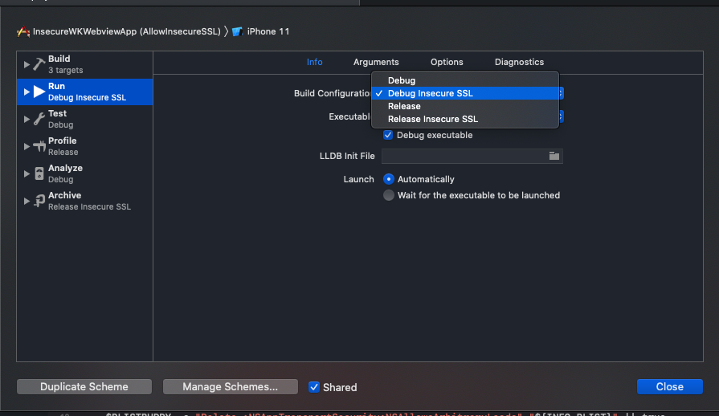

# To enable insecure SSL on WKWebView

1. create WKWebView with WKNavigationDelegate and add the delegate function

```swift
func isInsecureSSLAllowed() -> Bool {
    let appTransportSecurity = Bundle.main.object(forInfoDictionaryKey: "NSAppTransportSecurity") as! NSDictionary?
    let allowArbitraryLoads: Int = (appTransportSecurity?["NSAllowsArbitraryLoads"] ?? 0) as! Int;
    return allowArbitraryLoads == 1
}
```

```swift
func webView(_ webView: WKWebView, didReceive challenge: URLAuthenticationChallenge, completionHandler: @escaping (URLSession.AuthChallengeDisposition, URLCredential?) -> Void) {
    if (isInsecureSSLAllowed()) {
        let cred = URLCredential(trust: challenge.protectionSpace.serverTrust!)
        completionHandler(.useCredential, cred)
    } else {
        completionHandler(.performDefaultHandling, nil)
    }
}
```

2. Set `App Transport Security Settings` -> `Allow Arbitrary Loads` to `YES` in Info.plist

# To enable insecure SSL only on selected build configuration

1. Duplicate Debug/Release Build Configuration to Debug Insecure SSL/Release Insecure SSL


2. Add User Defined Setting based on Build Configuration


3. Allow Arbitrary Loads based on User Defined Setting


4. Duplicate Build Scheme for Insecure SSL


5. Select Debug Insecure SSL Build Configuration for new duplicated scheme



6. Select Release Insecure SSL Build Configuration for new duplicated scheme


7. Done.

Running Build Scheme with (AllowInsecureSSL) will allow you to access website with insecure SSL

Running default Build Scheme without (AllowInsecureSSL) will restrict you to access website with insecure SSL
